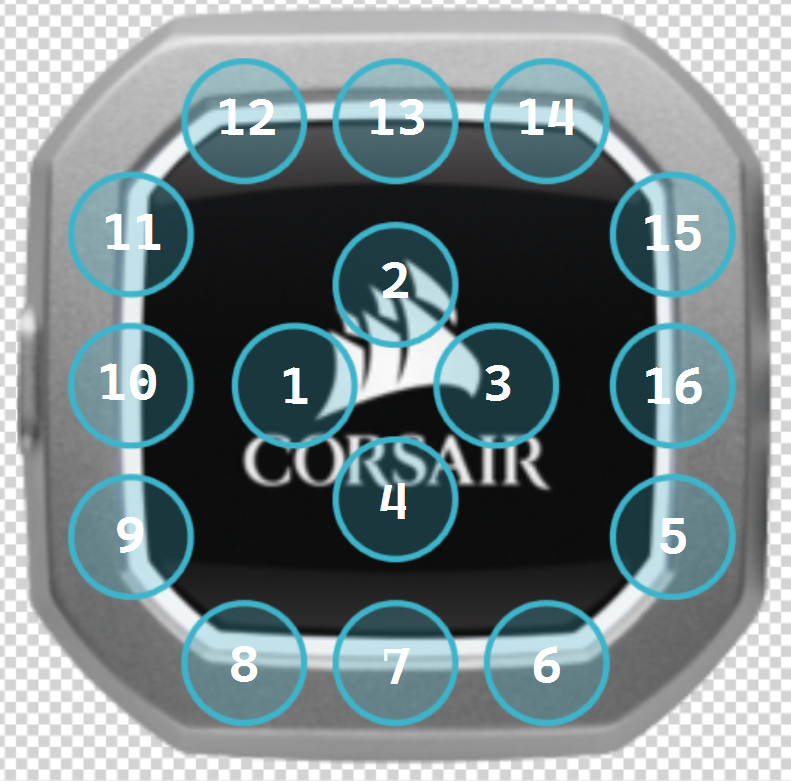
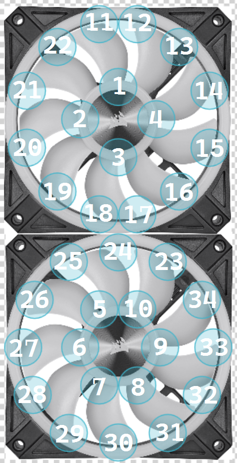

# Custom Artemis Corsair Layouts

> 💡 This repository includes custom layouts for [Artemis](https://github.com/Artemis-RGB/Artemis).

## H100i Cooler

This is a modified version of the H115i layout provided with [Artemis.Plugins](https://github.com/Artemis-RGB/Artemis.Plugins/blob/master/src/Devices/Artemis.Plugins.Devices.Corsair/Layouts/Corsair/Cooler/PUMP.xml).

Rather than a single LED, this includes all 16 LEDs mapped correctly.

| LED ID | Location      |
| :----: | ------------- |
|   1    | Centre left   |
|   2    | Centre top    |
|   3    | Centre right  |
|   4    | Centre bottom |
|   5    | Right bottom  |
|   6    | Bottom right  |
|   7    | Bottom centre |
|   8    | Bottom left   |
|   9    | Left bottom   |
|   10   | Left centre   |
|   11   | Left top      |
|   12   | Top left      |
|   13   | Top centre    |
|   14   | Top right     |
|   15   | Right top     |
|   16   | Right centre  |

The image was taken from the original H115i layout and renamed. Then the LEDs were mapped to the (approximate) correct locations:

## QL120 Fans

This is a custom layout as Artemis doesn't appear to include a layout for the QL120 fans.

> 💡 In the layout the image has the _front_ of the fan at the top, and the _rear_ of the fan at the bottom.

These fans include 34 LEDs which have been painstakingly mapped out to ensure the correct LED locations are used:

